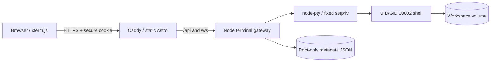

# CmdImpact terminal architecture

CmdImpact alpha is a single-owner web terminal. The browser UI and terminal gateway are separate processes in development and separate containers in the local Compose stack.



## Components

- Astro builds the landing page, sign-in screen, session manager, and terminal UI into `dist/`.
- Caddy serves `dist/` and proxies `/api/*` and `/ws` to the gateway. The default Compose port is bound to `127.0.0.1:4321`.
- `server/index.mjs` uses Node's HTTP server for the JSON API and `ws` for authenticated terminal connections.
- In the terminal container, the trusted gateway runs as UID 0 with only `KILL`, `SETUID`, and `SETGID`. Metadata is root-only, and the access token is removed from the live Node environment before shells start. It starts each fixed shell through `setpriv`, which changes to UID/GID 10002, clears supplementary groups and inheritable/ambient capabilities, and applies `no-new-privileges`.
- `server/session-manager.mjs` owns live `node-pty` processes, one controller per session, bounded in-memory scrollback, disconnect/reconnect, and timeouts.
- `server/store.mjs` atomically persists every non-exited record and the 100 newest exited metadata records. It never stores keystrokes or terminal output.

## HTTP API

Every mutation requires an exact allowed `Origin`. Authenticated requests use the HttpOnly owner cookie and `credentials: "include"`.

| Method | Path | Result |
| --- | --- | --- |
| `GET` | `/api/health` | Public process health |
| `GET` | `/api/me` | Authentication state and available shells |
| `GET` | `/api/auth/session` | Alias of `/api/me` |
| `POST` | `/api/auth/login` | Exchanges `{ "token": "..." }` for an HttpOnly cookie |
| `POST` | `/api/auth/logout` | Clears the cookie and closes live WebSockets |
| `GET` | `/api/sessions` | Lists live and exited session metadata |
| `POST` | `/api/sessions` | Creates a PTY from an allowed shell |
| `GET` | `/api/sessions/:id` | Reads one session |
| `PATCH` | `/api/sessions/:id` | Renames one session |
| `POST` | `/api/sessions/:id/stop` | Stops a live session |
| `DELETE` | `/api/sessions/:id` | Stops and removes a session record |

## WebSocket protocol

Connect to `/ws` on the same public origin. Authentication comes from the cookie; credentials never appear in the URL.

1. Server: `{ "type": "hello", "protocol": 1, "attachWithinMs": 10000 }`
2. Client: `{ "type": "attach", "sessionId": "uuid", "takeover": false }`
3. Server: `{ "type": "ready", "protocol": 1, "session": {}, "writable": true }`
4. Server may replay bounded memory output as `{ "type": "output", "data": "...", "replay": true }`.

After attachment, the client may send `input`, `resize`, `take-control`, `ping`, or `detach`. The server sends `output`, `control`, `pong`, `exit`, or `error`. Client frames are JSON text, at most 64 KiB; an individual input is at most 32 KiB. Dimensions, connection count, input rate, output rate, and buffered output are bounded.

Only one connection can write to a session. Additional devices are read-only until they send `take-control`; the previous controller remains connected as a viewer.

## Session lifecycle

```text
create -> running -> detached -> running
                    |            |
                    +----------> exited -> deleted
```

- Closing a tab detaches the socket but leaves the PTY running.
- A later authenticated browser can attach with the same session ID and receives bounded in-memory scrollback.
- Detached sessions stop after `TERMINAL_IDLE_MINUTES`; every PTY stops after `TERMINAL_HARD_HOURS`.
- A server or container restart cannot recover a `node-pty` process. On startup, stale `running` or `detached` metadata is honestly changed to `exited` with reason `server-restarted`.

Exact process restoration across host restarts is not part of this alpha. A later hosted version needs a sandbox service with memory snapshots or a dedicated per-session runtime. E2B documents both [PTY reconnection](https://docs.e2b.dev/sdk-reference/js-sdk/v2.10.5/commands) and [filesystem-and-memory pause/resume](https://docs.e2b.dev/sandbox/persistence); a self-hosted alternative requires a hardened runner such as [gVisor `runsc`](https://gvisor.dev/docs/user_guide/quick_start/docker/).

## Local and container operation

Run `npm run setup` once, then start the complete containerized product:

```bash
npm run dev
```

Open <http://localhost:4321/app/>. `npm start` and `npm run docker:up` run the same Compose stack.

Compose accepts `.env` overrides for `TERMINAL_ACCESS_TOKEN`, `TERMINAL_ALLOWED_ORIGINS`, `TERMINAL_ALLOW_INSECURE_LOCALHOST`, session/time limits, `TERMINAL_COOKIE_HOURS`, and `TRUST_PROXY`. The token enters only the trusted root gateway, which derives the login verifier and removes it from the live Node environment before shells start; host and Docker administrators remain trusted. Bind address, backend port, workspace, state-file path, and PTY identity are fixed by the container image. Their direct-host environment variables are not Compose overrides.

For frontend development, run the direct host backend and Astro dev server in separate terminals:

```bash
npm run dev:server
npm run dev:ui
```

`npm run server` starts the backend without watch mode. Direct-host mode uses allowlisted installed shells—PowerShell/cmd on Windows and bash/sh on macOS or Linux—runs as the host user, provides no command isolation, and must remain local-only.
