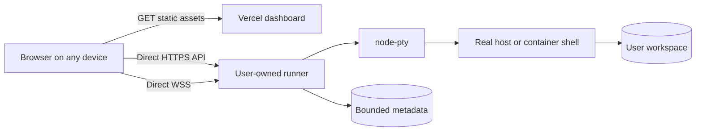

# CmdImpact architecture

CmdImpact separates a globally hosted static dashboard from persistent, user-owned terminal runners. This is a browser-to-runner system, not a hosted terminal backend.



Vercel never sits between the browser and runner. It has no `/api` or `/ws` rewrite and receives no access token, bearer session token, command, keystroke, terminal output, or runner metadata. It serves the same static Astro build worldwide.

## Components

### Static dashboard

- Astro builds the landing page, runner sign-in, session manager, and xterm.js terminal into `dist/`.
- The browser validates and saves the exact runner origin in `localStorage`. Arbitrary remote runner origins must use HTTPS; HTTP is accepted only for loopback development.
- The access token exists only long enough to call the runner login endpoint. It is never written to browser storage.
- For cross-site runners, a signed, expiring bearer session token is stored in `sessionStorage` alongside its runner origin. Its default lifetime is 12 hours and follows `TERMINAL_COOKIE_HOURS`; changing origins discards it.
- API requests go directly to `${runnerOrigin}/api/*`; terminal sockets go directly to the corresponding `wss://.../ws` endpoint.
- The dashboard contains no analytics, Speed Insights, ad-network runtime, or third-party script. Its app-scoped notification worker has no fetch, cache, or push handler.

### Persistent runner

- `server/index.mjs` uses Node's HTTP server for the JSON API and `ws` for terminal connections.
- `server/session-manager.mjs` owns live `node-pty` processes, one active writer per session, bounded in-memory scrollback, reconnects, attention metadata, and optional timeouts.
- `server/store.mjs` atomically stores all non-exited metadata and the 100 newest exited metadata records. It never stores keystrokes or terminal output.
- On a direct host, shells run as the operating-system user that launched the runner.
- In the Linux container, the trusted Node gateway retains only the capabilities required to launch and clean up lower-privileged PTYs. A fixed `setpriv` command drops each shell to UID/GID 10002 with no inheritable or ambient capabilities and with `no-new-privileges`.

One runner has one owner security boundary. Many people can use CmdImpact globally by operating independent runners; the alpha does not put mutually untrusted owners on one runner.

## Selecting and authenticating a runner

```text
1. Browser loads the static Vercel dashboard.
2. User enters an exact HTTPS runner origin.
3. Browser POSTs the access token directly to runner /api/auth/login.
4. Runner verifies the dashboard Origin and access token.
5. Runner returns a signed session token and a same-origin cookie; both default to a 12-hour lifetime configured by `TERMINAL_COOKIE_HOURS`.
6. Cross-site API requests use Authorization: Bearer <session-token>.
7. Cross-site WebSockets use Sec-WebSocket-Protocol: cmdimpact.auth.<session-token>.
```

The token is never placed in a URL. Cross-site fetches omit cookies; the bearer token is the authentication mechanism. Same-origin local deployments can use the signed HttpOnly cookie. Every state-changing request and every WebSocket upgrade must also match `TERMINAL_ALLOWED_ORIGINS` exactly.

The access token is login-only and is not retained by the dashboard. The short session token is tab-scoped storage, not a durable device credential. When it expires, the user signs in again; existing PTY work remains on the runner.

## HTTP API

| Method | Path | Result |
| --- | --- | --- |
| `GET` | `/api/health` | Public runner health |
| `GET` | `/api/me` | Authentication state and available shells |
| `GET` | `/api/auth/session` | Alias of `/api/me` |
| `POST` | `/api/auth/login` | Exchanges the owner access token for expiring session authentication |
| `POST` | `/api/auth/logout` | Clears the cookie and closes currently connected sockets |
| `GET` | `/api/sessions` | Lists live and exited session metadata |
| `POST` | `/api/sessions` | Creates a PTY using an allowed shell identifier |
| `GET` | `/api/sessions/:id` | Reads one session record |
| `PATCH` | `/api/sessions/:id` | Renames one session |
| `POST` | `/api/sessions/:id/stop` | Stops a live session |
| `DELETE` | `/api/sessions/:id` | Stops the PTY and removes its record |

Cross-origin responses name the requesting allowed origin; the runner does not use wildcard CORS. Request bodies, names, session counts, and rates are bounded.

## WebSocket protocol

The browser connects to `/ws` on the selected runner. Cross-site authentication uses the `cmdimpact.auth.<session-token>` WebSocket subprotocol; same-origin local connections may use the cookie.

1. Server: `{ "type": "hello", "protocol": 1, "attachWithinMs": 10000 }`
2. Client: `{ "type": "attach", "sessionId": "uuid", "takeover": false }`
3. Server: `{ "type": "ready", "protocol": 1, "session": {}, "writable": true }`
4. Server may replay bounded memory output as `{ "type": "output", "data": "...", "replay": true }`.

After attachment, the client can send `input`, `resize`, `take-control`, `ping`, or `detach`. The server sends `output`, `control`, `pong`, `exit`, or `error`. Client frames are JSON text and bounded to 64 KiB; an individual input is bounded to 32 KiB. Dimensions, connections, input/output rates, scrollback, and socket backpressure are also bounded. Compression is disabled.

Only one connection writes to a session. Additional devices attach read-only until one requests control; the previous controller stays connected as a viewer.

## Session lifecycle and persistence

```text
create -> running <-> detached -> exited -> deleted
             ^           |
             +-- attach --+
```

- Closing the tab, browser, or phone detaches the socket and leaves the PTY running.
- `TERMINAL_IDLE_MINUTES=0` and `TERMINAL_HARD_HOURS=0` disable automatic expiry by default.
- With those defaults, work continues until the user ends it, the shell exits, the runner restarts, or the host goes offline.
- A later authenticated device attaches to the same session ID and receives the bounded output still held in runner memory.
- Positive idle or hard values opt into automatic cleanup.
- Workspace files and bounded metadata can persist across restart; a live `node-pty` process and its memory cannot. At startup, stale running metadata is marked exited with reason `server-restarted`.

This design solves browser and device continuity, not host-failure continuity. Durable PTY restoration requires an external supervisor or sandbox runtime and remains roadmap work.

## Real CLI execution

The terminal sends input to a real shell. Git, GitHub CLI, npm, pnpm, deployment CLIs, Claude, Codex, and other agent tools work only when they are installed and authenticated in that shell environment. CmdImpact does not hold provider credentials, translate commands, restrict execution to an integration catalog, or change a tool's permissions.

Direct-host commands inherit the host user's effective access. Container commands share the terminal user's workspace and allowed outbound network. A command can change files, install packages, deploy software, spend paid API credits, publish data, or delete everything its shell identity can reach.

## Paste review and attention detection

Every non-empty paste is intercepted for review before being sent. The static analyzer can recognize common high-risk shapes, but shell aliases, substitutions, downloaded code, scripts, and tool-specific behavior make proof impossible. A command with no warning is not guaranteed safe.

The runner records bounded attention metadata for terminal output patterns. While the dashboard remains open, it polls the runner and can show a generic browser notification when the tab is in the background. There is no closed-tab push channel, remote notification service, or terminal content in notification payloads.

## Deployment modes

### Global dashboard plus direct runner

```bash
npm run setup -- --origin https://YOUR-VERCEL-DOMAIN --workspace /path/to/projects
npm run server
```

PowerShell paths are accepted. The HTTPS dashboard origin selects production mode; HTTP remains loopback-only. Put the loopback runner behind an HTTPS/WSS proxy or trusted tunnel and enter that public runner origin in the dashboard.

### Local isolated stack

`npm start` builds the static dashboard and runner containers, exposes only `127.0.0.1:4321`, and proxies local `/api` and `/ws` through Caddy. Named volumes hold the container workspace and metadata. The container image, not `.env`, fixes its internal bind address, ports, workspace path, state path, and PTY UID/GID.

The same isolated stack can serve a global dashboard when setup receives the exact Vercel origin and an external HTTPS/WSS proxy forwards to `127.0.0.1:4321`. In that mode the browser still talks directly to the proxied runner; Vercel is not the proxy. Compose keeps `/workspace` in its named volume, so the direct-host `--workspace` option does not change the container path.

### Vercel static deployment

`vercel.json` publishes `dist/` and adds security and cache headers. `PUBLIC_SITE_URL` overrides the canonical origin; otherwise `astro.config.mjs` uses `https://${VERCEL_PROJECT_PRODUCTION_URL}` on Vercel and localhost outside Vercel. There are intentionally no Function routes, API/WS rewrites, analytics packages, or terminal environment variables.

The Vercel Content Security Policy permits `https:` and `wss:` connections because runner origins differ for every owner, plus HTTP/WS loopback sources for development. Runner URL validation and the runner's exact origin allowlist remain the operative connection boundaries.
